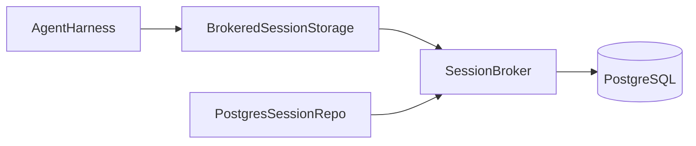

# Phase 0B: Versioned Session Broker Design

**Goal:** Replace enterprise session file persistence with a PostgreSQL-backed, versioned session broker that preserves Pi session semantics, rejects stale writes atomically, and gives Runtime Stage A a `BrokeredSessionStorage` bridge without introducing JSONL enterprise state.

## 1. Scope

Phase 0B is the persistence and concurrency foundation for enterprise sessions.
It is deliberately narrow:

- build a PostgreSQL-backed session store and session repository;
- add atomic `appendAndAdvance` and `moveLeaf` broker commands;
- expose a run-scoped `BrokeredSessionStorage` adapter for `AgentHarness`;
- prove restart, conflict, fork, and recovery behavior with integration tests;
- keep JSONL out of enterprise persistence entirely.

This phase does not introduce the full Conversation / Run control plane, UI
navigation, approvals, or Stage B Coding Agent RPC compatibility. It only lays
the durable session-graph substrate those later phases need.

## 2. Chosen architecture

The implementation lives in a dedicated workspace package:

- `packages/enterprise-session-broker`

That package owns:

- PostgreSQL migrations and schema bootstrap;
- the broker service that performs transactional session mutations;
- `PostgresSessionStorage` and `PostgresSessionRepo` adapters for
  `@earendil-works/pi-agent-core`;
- `BrokeredSessionStorage`, a run-scoped proxy that carries the current
  expected version and talks to the broker through a private local transport;
- integration tests for restart, stale-version rejection, and fork recovery.

The broker is the only authority for enterprise session mutation. The storage
adapter is not allowed to append directly to tables. It must go through the
broker so every mutation can compare-and-set the current durable version.

### Why this shape

1. A separate package keeps database code out of the web UI and away from the
   local-only session implementation.
2. Plain SQL migrations keep the schema explicit and easy to inspect.
3. A broker/proxy split lets later control-plane and worker transport changes
   happen without rewriting `AgentHarness`-facing code.

### Alternatives considered

- Embed the broker inside the Next.js app. Rejected because it leaks DB
  semantics into the UI package and makes later worker extraction harder.
- Use Prisma/Drizzle for the schema. Rejected because the schema is small, the
  transaction rules matter more than ORM ergonomics, and codegen would add
  friction without solving concurrency.
- Keep JSONL as a fallback path. Rejected because enterprise mode must not
  depend on local session files at all.

## 3. Data model

Phase 0B uses two business tables and one migration table.

### 3.1 `enterprise_schema_migrations`

Tracks which SQL migration files have been applied.

- `name text primary key`
- `applied_at timestamptz not null default now()`

### 3.2 `enterprise_sessions`

One row per durable enterprise session.

Suggested columns:

- `id text primary key`
- `organization_id text not null`
- `workspace_root text not null`
- `scope jsonb not null default '{}'::jsonb`
- `metadata jsonb not null default '{}'::jsonb`
- `parent_session_id text null`
- `created_at timestamptz not null`
- `updated_at timestamptz not null`
- `deleted_at timestamptz null`
- `version bigint not null default 0`
- `active_leaf_id text null`

Notes:

- `organization_id` is first-class because every enterprise table must be
  organization-scoped.
- `scope` is an opaque JSONB bucket for future control-plane identifiers such
  as conversation, run, attempt, lease, or capability values. Phase 0B stores
  them, but does not build the full control-plane model yet.
- `active_leaf_id` stores the current durable leaf target, not the leaf row id.
- `deleted_at` is a tombstone so `delete()` can be logical in phase 0B instead
  of destroying provenance immediately.

### 3.3 `enterprise_session_entries`

Immutable append-only session tree rows.

Suggested columns:

- `session_id text not null`
- `version bigint not null`
- `entry_id text not null`
- `parent_id text null`
- `entry_type text not null`
- `entry jsonb not null`
- `recorded_at timestamptz not null`

Constraints and indexes:

- primary key `(session_id, version)`
- unique `(session_id, entry_id)`
- index `(session_id, entry_type)`
- index `(session_id, parent_id)`
- foreign key `session_id -> enterprise_sessions.id on delete cascade`

The row stores the full typed `SessionTreeEntry` payload as JSONB so message,
label, branch, compaction, custom, and leaf entries all round-trip without a
JSONL format.

## 4. Broker contract

The broker is the transactional boundary. It owns version checks and turns
stale writes into a conflict result instead of a partial append.

### 4.1 Reads

The broker must provide read methods for:

- opening a session snapshot;
- listing sessions by organization and optional workspace root;
- loading entries in version order;
- fetching one entry by id;
- walking the path from root to a leaf;
- resolving the latest label for a target id.

### 4.2 Mutations

The broker must provide atomic commands:

- `appendAndAdvance`
- `moveLeaf`
- `fork`
- `delete`

Mutation rules:

1. The broker locks the session row inside one PostgreSQL transaction.
2. The caller supplies the expected durable version.
3. If the version mismatches, the broker returns the current durable version and
   current leaf, and it writes nothing.
4. If validation fails for parent existence, target existence, fork target
   rules, or organization mismatch, the transaction rolls back.
5. On success, the session version increments by exactly one for each logical
   append.

### 4.3 Conflict semantics

The broker uses a typed conflict result, not a silent retry.

- low-level broker call: returns `{ ok: false, currentVersion, currentLeafId }`
  on a stale write;
- `BrokeredSessionStorage`: converts that into a stable session error so the
  harness can stop or retry explicitly;
- direct reads after a conflict always see the durable committed state.

## 5. Storage and repository adapters

### 5.1 `PostgresSessionStorage`

Implements `SessionStorage` from `@earendil-works/pi-agent-core`.

It must support:

- `getMetadata()`
- `getLeafId()`
- `setLeafId()`
- `createEntryId()`
- `appendEntry()`
- `getEntry()`
- `findEntries()`
- `getLabel()`
- `getPathToRoot()`
- `getEntries()`

Behavior:

- read methods query PostgreSQL;
- `setLeafId()` and `appendEntry()` route through the broker’s atomic mutation
  path;
- the instance caches only the latest committed version/leaf needed to issue
  the next mutation;
- any stale local state is corrected by the broker conflict response.

### 5.2 `PostgresSessionRepo`

Implements `SessionRepo` for enterprise sessions.

Behavior:

- `create()` inserts a new session row and returns a storage handle;
- `open()` loads the session by metadata and rejects deleted or missing rows;
- `list()` filters by organization and optional workspace root;
- `delete()` marks the session deleted, leaving the row and entries intact;
- `fork()` copies the selected path into a new session with fresh version
  numbering and an inherited or overridden workspace root/metadata payload.

Fork semantics must match the current Pi session contract:

- no JSONL dependency;
- copy only the selected branch path;
- preserve entry ids inside the new session;
- reset the new session’s active leaf to the copied path tip;
- reject invalid fork targets the same way the local session repo does.

### 5.3 `BrokeredSessionStorage`

This is the run-scoped adapter that `AgentHarness` can use without knowing about
PostgreSQL.

Responsibilities:

- hold the current session snapshot and expected version;
- forward all mutations to the broker;
- refresh or reopen after restart;
- preserve the synchronous feel of `SessionStorage` while keeping the actual
  authority in PostgreSQL.

The adapter is not allowed to bypass the broker for writes.

## 6. Transaction rules

The mutation transaction must be small and deterministic.

### 6.1 `appendAndAdvance`

1. Lock the session row.
2. Verify organization and expected version.
3. Verify the parent id exists or is null.
4. Insert the new entry row with `version = currentVersion + 1`.
5. Update the session row’s `version`, `active_leaf_id`, and
   `updated_at`.
6. Commit and return the new version and entry id.

### 6.2 `moveLeaf`

1. Lock the session row.
2. Verify organization and expected version.
3. Verify the target entry exists or is null.
4. Insert a `leaf` entry row with the current leaf as `parent_id`.
5. Update the session row’s `version`, `active_leaf_id`, and
   `updated_at`.
6. Commit and return the new version and leaf target.

### 6.3 `fork`

1. Lock the source session row.
2. Resolve the fork path using the current entry graph.
3. Create the destination session row.
4. Copy the selected entries into the destination session.
5. Set the destination active leaf to the copied tip.
6. Commit and return the destination snapshot.

### 6.4 `delete`

1. Lock the session row.
2. Mark `deleted_at`.
3. Commit.

No mutation may leave the session row updated while the entry row is missing, or
vice versa. If any step fails, PostgreSQL rolls the transaction back.

## 7. Error handling

The package must expose stable error categories that are easy to test.

- `not_found`: missing session or entry
- `invalid_session`: broken graph, deleted session, or stale handle use
- `invalid_entry`: malformed stored entry payload
- `invalid_fork_target`: branch selection does not satisfy the Pi contract
- `storage`: PostgreSQL or transport failure
- `version_conflict`: stale write detected by the broker

Conflict handling is important enough to test separately from generic storage
errors. A version conflict must not be collapsed into a generic database
failure.

## 8. Restart behavior

Restart is part of the contract, not an accident.

After process restart:

- reopening a session must reconstruct the latest version and active leaf from
  PostgreSQL;
- the first mutation after restart must use the durable version, not stale
  in-memory state;
- a stale `BrokeredSessionStorage` handle must fail predictably instead of
  quietly overwriting concurrent work.

## 9. Testing strategy

Phase 0B needs real database coverage, not a mock-only happy path.

### 9.1 Unit tests

- entry serialization and round-trip reconstruction;
- label lookup;
- path-to-root walking;
- fork target validation;
- error mapping.

### 9.2 Integration tests

- migration bootstrap on an empty PostgreSQL database;
- `create` / `open` / `list` / `delete` / `fork` round-trips;
- `appendAndAdvance` stale-version rejection with exactly one winning writer;
- `moveLeaf` stale-version rejection and leaf recovery after reopen;
- restart of a fresh storage/repo instance against existing rows;
- `BrokeredSessionStorage` through `AgentHarness` with a real session snapshot;
- no enterprise code path imports or writes JSONL.

The tests run against the compose PostgreSQL service from
`compose.enterprise.yml` and reset to a clean schema for each suite.

## 10. Acceptance criteria

Phase 0B is done when all of the following are true:

1. PostgreSQL is the only enterprise session authority.
2. A session can be created, reopened, forked, and deleted through the new
   broker package.
3. `appendAndAdvance` and `moveLeaf` reject stale versions without partial
   persistence.
4. A restarted storage/repo instance sees the durable version and leaf exactly
   as PostgreSQL stored them.
5. `BrokeredSessionStorage` can back `AgentHarness` without reintroducing JSONL
   enterprise state.
6. The integration tests pass against a real PostgreSQL instance.
